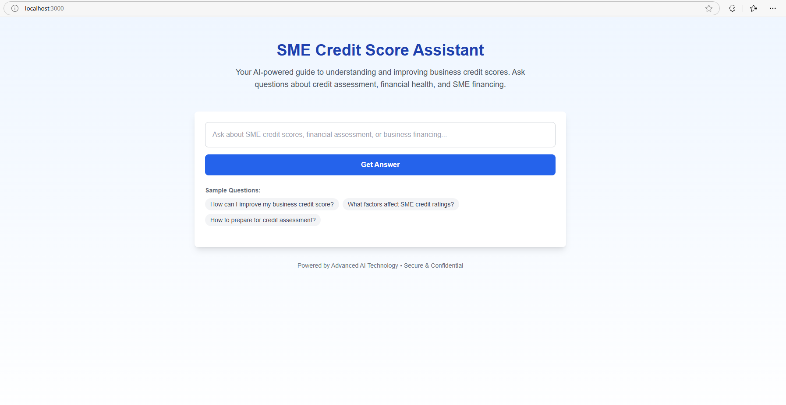

# 🏦 OnChainCred – AI-Powered On-Chain Credit Guide & Saving Agent 🚀  

OnChainCred is an **AI-powered knowledge base and on-chain saving agent** that helps **small businesses (SMBs) and startups** build their **on-chain credit history**.  


*How our client application is looking like*

Powered by **Llama-3 AI** and integrated with **Privy, The Graph, and Collab.Land**, OnChainCred provides:  
✅ **AI-driven financial guidance** for credit-building strategies  
✅ **Seamless wallet onboarding** for non-Web3 users  
✅ **On-chain analytics** to track credit progress  

---

## 🔗 **Live Demo & Repository** 
- 🌐 **Live App:** [Onchain Credit Agent](https://onchain-credit-agent.vercel.app/)  
- 📂 **GitHub Repo:** [https://github.com/johnaschami/onchain-credit-agent](https://github.com/johnaschami/onchain-credit-agent)  

---

## 📖 **What It Does**
🔹 **AI-Powered Knowledge Base** – Users ask financial questions, and **Llama-3 AI** provides personalized responses.  
🔹 **On-Chain Saving Agent** – AI **suggests actions** (like staking, lending, or deposits) to **improve creditworthiness**.  
🔹 **Seamless Wallet Onboarding** – **Privy** allows users to create a wallet instantly without needing private keys.  
🔹 **On-Chain Tracking** – **The Graph** tracks users' on-chain financial actions and visualizes their credit-building journey.  

🚀 *OnChainCred makes **blockchain finance simple & actionable** for SMBs!*

---

## ⚙️ **Tech Stack**
### **Backend (Express.js + Llama-3 AI)**
- **Llama-3 AI** – Handles AI-generated financial advice  
- **Express.js** – API server to communicate with AI  
- **Axios** – Handles API requests  

### **Frontend (Next.js + Privy + The Graph)**
- **Next.js** – Frontend UI  
- **Privy** – Wallet onboarding  
- **The Graph** – On-chain data analytics  

---

## 🛠 **Setup & Installation**
### **1️⃣ Clone the Repository**
```bash
git clone https://github.com/johnaschami/onchain-credit-agent.git
cd onchain-credit-agent
